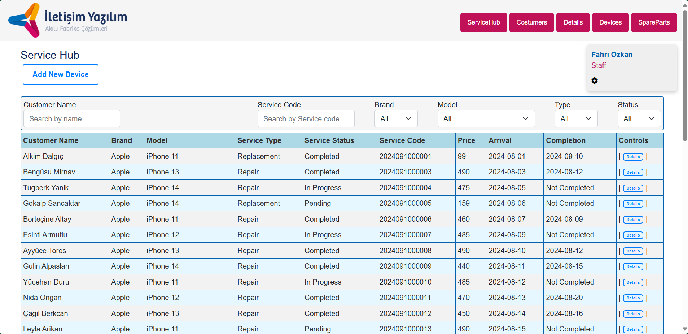

# Apple Technical Service

- Developed for [İletişim Yazılım](https://www.iletisimyazilim.com/)
- General technical service application linked to a database (categorised with Apple brand phones for context)

   - Login System: The service has 4 different employee roles and each role has different characteristics
 
     - Staff: Worker role who can add new device information
     - Supervisor: A higher level role that can edit on newly added device, customer, detail
     - Manager: Manager role with all authorisations that do not create security problems
     - Admin: Admin class with all authorisations

   - CRUD Functions: has user-friendly CRUD functions that can be done in an easy way

     - A special service code is set for each line so that it is easy to identify and find
     - Pricing is done automatically according to the selected parts and the work to be done
     - Records are kept in two separate tables, Customers and Details, in case they need to be accessed separately
     - The Employees page is available where an administrator can create an employee account in any role (other than manager) and review employees
     - The SpareParts page is also available, where part properties (Price,Barcode, Etc.) can be viewed and edited
     - The desired table row can be printed as a technical service form

   - Filter System: The service has general and specific filters and a search bar for each table to be searched
 
- Views of the Application:
   - Login Page
     
   - Service Hub (Admin Login)
     
   - Service Hub (Staff Login)
     
  
